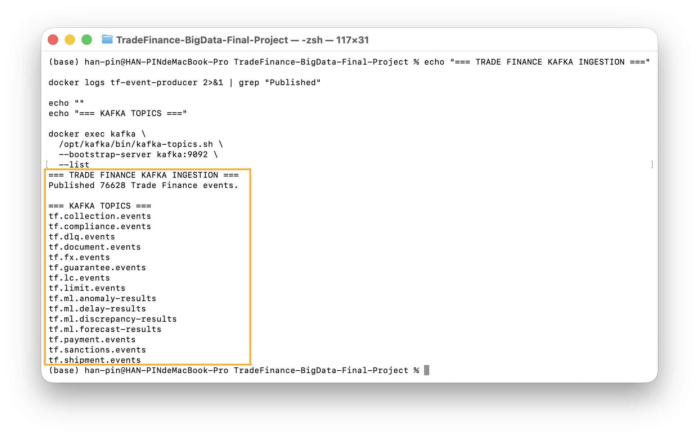
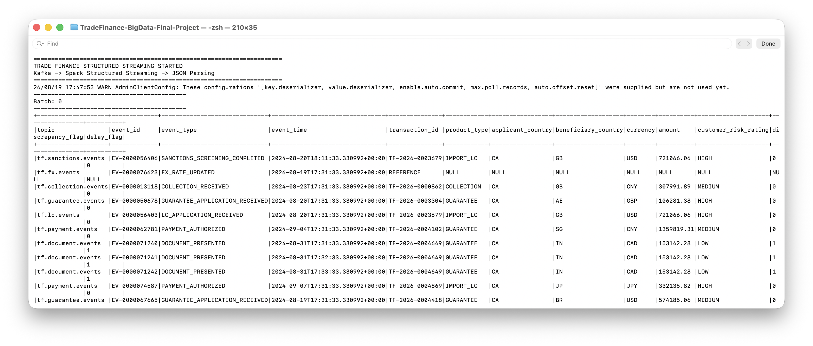
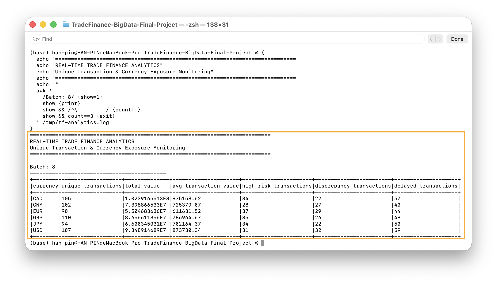
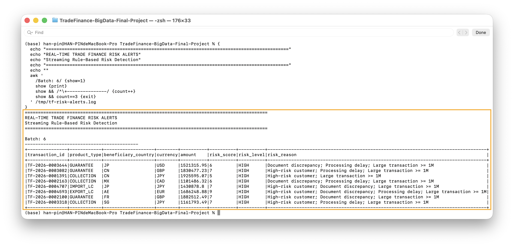

# Trade Finance Real-Time Streaming and Risk Monitoring

**Project:** Trade Finance Intelligence and Risk Management  
**Role:** Member 3 – Real-Time Big Data Engineering  
**Developed by:** Han-Pin Hung  

---

# Overview

This module implements the **real-time Big Data Engineering layer** of the Trade Finance Intelligence and Risk Management platform.

The solution uses **Apache Kafka** and **Apache Spark Structured Streaming** to process Trade Finance lifecycle events, generate real-time business analytics, and identify high-risk transactions.

The main responsibilities of this module are:

- Kafka event ingestion
- Multi-topic event streaming
- Spark Structured Streaming
- JSON parsing and validation
- Transaction-level field extraction
- Transaction deduplication
- Real-time currency exposure analytics
- Rule-based risk scoring
- High-risk transaction alerts

---

# Real-Time Architecture

```text
Trade Finance Data Generator
        |
        v
Kafka Event Producer
        |
        v
Multiple Kafka Topics
        |
        v
Spark Structured Streaming
        |
        +--------------------------+
        |                          |
        v                          v
Structured Events          Real-Time Analytics
                                   |
                                   v
                            Risk Scoring Engine
                                   |
                                   v
                           HIGH-RISK ALERTS
```

The real-time pipeline transforms raw Trade Finance lifecycle events into structured business information and actionable risk alerts.

---

# Module Structure

```text
structured_streaming/
├── trade_finance_streaming.py
├── trade_finance_analytics.py
├── trade_finance_risk_alerts.py
├── screenshots/
│   ├── 01_Kafka_Ingestion.png
│   ├── 02_Spark_Structured_Streaming.png
│   ├── 03_Real_Time_Trade_Finance_Analytics.png
│   └── 04_Real_Time_Risk_Alerts.png
└── README.md
```

---

# 1. Kafka Event Ingestion

Trade Finance transactions generate multiple lifecycle events.

Examples include:

```text
LC_APPLICATION_RECEIVED
GUARANTEE_APPLICATION_RECEIVED
COLLECTION_RECEIVED
PAYMENT_AUTHORIZED
DOCUMENT_PRESENTED
SHIPMENT_RECORDED
COMPLIANCE_SCREENING_COMPLETED
SANCTIONS_SCREENING_COMPLETED
LIMIT_CHECK_COMPLETED
FX_RATE_UPDATED
```

These events are published to Kafka and separated into business-specific topics.

## Kafka Topics

```text
tf.lc.events
tf.guarantee.events
tf.collection.events
tf.payment.events
tf.document.events
tf.shipment.events
tf.compliance.events
tf.sanctions.events
tf.limit.events
tf.fx.events
```

The event producer successfully published:

```text
76,628 Trade Finance lifecycle events
```

across the Trade Finance Kafka topics.

---

## Demonstration Evidence – Kafka Ingestion



**Figure 1. Kafka Trade Finance Event Ingestion**

The Kafka producer successfully publishes Trade Finance lifecycle events across multiple business topics, providing the event source for the real-time processing pipeline.

---

# 2. Spark Structured Streaming

## Application

```text
trade_finance_streaming.py
```

Apache Spark Structured Streaming consumes Trade Finance events directly from Kafka.

The application performs the following steps:

```text
Kafka Event
    ↓
Read Kafka Message
    ↓
Convert Binary Value to String
    ↓
Parse JSON
    ↓
Validate Event
    ↓
Extract Business Fields
    ↓
Structured Trade Finance Record
```

The Spark application subscribes to the Trade Finance topics using a topic pattern and continuously processes arriving events.

---

## Extracted Business Fields

The application extracts fields including:

- Transaction ID
- Event type
- Product type
- Applicant country
- Beneficiary country
- Currency
- Transaction amount
- Customer risk rating
- Discrepancy flag
- Delay flag

These fields provide the structured data required for downstream analytics and risk monitoring.

---

## Demonstration Evidence – Structured Streaming



**Figure 2. Kafka to Spark Structured Streaming**

Spark Structured Streaming consumes events from multiple Kafka topics, parses the JSON payloads, and transforms the incoming messages into structured Trade Finance business records.

---

# 3. Real-Time Trade Finance Analytics

## Application

```text
trade_finance_analytics.py
```

The second streaming application transforms incoming Trade Finance records into real-time management-level KPIs.

---

## Transaction Deduplication

A single Trade Finance transaction can generate multiple lifecycle events.

For example:

```text
LC_APPLICATION_RECEIVED
        ↓
LIMIT_CHECK_COMPLETED
        ↓
COMPLIANCE_SCREENING_COMPLETED
        ↓
SANCTIONS_SCREENING_COMPLETED
        ↓
DOCUMENT_PRESENTED
        ↓
PAYMENT_AUTHORIZED
```

These lifecycle events may contain the same transaction amount.

If every event were included in the financial aggregation, the same transaction could be counted multiple times.

Therefore, the analytics application performs transaction-level deduplication using:

```text
transaction_id
```

before calculating transaction-level KPIs.

This prevents duplicated lifecycle events from overstating transaction volume and financial exposure.

---

# Real-Time KPIs

The analytics application calculates:

- Unique transaction count
- Total transaction value
- Average transaction value
- High-risk transaction count
- Document discrepancy transaction count
- Delayed transaction count

---

# Currency Exposure Monitoring

Trade Finance transactions are denominated in multiple currencies, including:

```text
CAD
CNY
EUR
GBP
JPY
USD
```

Different currencies should not be directly combined into a single transaction-value total without currency conversion.

Therefore, the real-time analytics application groups transactions by currency.

The output provides:

```text
currency
unique_transactions
total_value
avg_transaction_value
high_risk_transactions
discrepancy_transactions
delayed_transactions
```

This provides a simple real-time view of Trade Finance exposure and operational risk by currency.

---

## Demonstration Evidence – Real-Time Analytics



**Figure 3. Real-Time Trade Finance Currency Exposure Analytics**

Spark Structured Streaming aggregates unique Trade Finance transactions by currency and continuously monitors transaction volume, transaction value, high-risk activity, document discrepancies, and processing delays.

---

# 4. Real-Time Risk Detection and Alerts

## Application

```text
trade_finance_risk_alerts.py
```

The final Member 3 application implements a transparent **rule-based real-time risk engine**.

Each unique Trade Finance transaction is evaluated using several risk indicators.

---

# Risk Scoring Rules

| Risk Factor | Score |
|---|---:|
| High-risk customer | +3 |
| Document discrepancy | +2 |
| Processing delay | +2 |
| Transaction amount >= 1,000,000 | +2 |

---

# Risk Classification

| Risk Score | Risk Level |
|---:|---|
| 0–2 | LOW |
| 3–4 | MEDIUM |
| 5+ | HIGH |

Transactions classified as:

```text
HIGH
```

are immediately displayed in the real-time alert stream.

---

# Risk Alert Output

Each high-risk alert includes:

- Transaction ID
- Product type
- Beneficiary country
- Currency
- Transaction amount
- Risk score
- Risk level
- Human-readable risk reason

Example:

```text
Transaction ID:
TF-2026-0004593

Product:
EXPORT_LC

Risk Score:
9

Risk Level:
HIGH

Risk Reasons:
High-risk customer
Document discrepancy
Processing delay
Large transaction >= 1M
```

The human-readable `risk_reason` field provides explainability and allows users to understand why an alert was generated.

---

## Demonstration Evidence – Risk Alerts



**Figure 4. Real-Time Trade Finance Risk Detection and Alerts**

Spark Structured Streaming applies rule-based risk scoring to Trade Finance transactions and generates high-risk alerts based on customer risk, document discrepancies, processing delays, and large transaction values.

---

# 5. End-to-End Member 3 Pipeline

The complete Member 3 workflow is:

```text
Trade Finance Events
        ↓
Kafka Producer
        ↓
Kafka Topics
        ↓
Spark Structured Streaming
        ↓
JSON Parsing
        ↓
Data Validation
        ↓
Structured Transaction Fields
        ↓
Transaction Deduplication
        ↓
Real-Time Analytics
        ↓
Risk Scoring
        ↓
HIGH-RISK ALERTS
```

This demonstrates a complete real-time data engineering pipeline rather than isolated processing tasks.

---

# Technologies

The implementation uses:

- Apache Kafka
- Apache Spark 3.5.0
- Spark Structured Streaming
- PySpark
- Python
- Docker
- HDFS
- YARN

Kafka integration package:

```text
org.apache.spark:spark-sql-kafka-0-10_2.12:3.5.0
```

---

# 6. Live Demo Quick Commands

> This section is designed for the final project demonstration.

Run the commands from the project root:

```text
TradeFinance-BigData-Final-Project
```

---

## Demo Step 1 – Verify Big Data Services

```bash
docker compose ps
```

Confirm that the required services are running.

For Member 3, the most important services are:

```text
kafka
spark-master
spark-worker
```

---

## Demo Step 2 – Verify Kafka Event Publication

Check the Trade Finance producer output:

```bash
echo "=== TRADE FINANCE KAFKA INGESTION ==="
docker logs tf-event-producer 2>&1 | grep "Published"
```

Expected result:

```text
Published 76628 Trade Finance events.
```

---

## Demo Step 3 – Show One Real Kafka Event

Display one Letter of Credit event from Kafka:

```bash
docker exec kafka \
  /opt/kafka/bin/kafka-console-consumer.sh \
  --bootstrap-server kafka:9092 \
  --topic tf.lc.events \
  --from-beginning \
  --max-messages 1
```

Expected result:

A JSON Trade Finance event should appear.

This confirms that Kafka contains actual Trade Finance messages.

---

# 7. Prepare Spark Applications

The Spark applications are copied into the Spark Master container.

Create the application directory if necessary:

```bash
docker exec spark-master mkdir -p /opt/member3
```

Copy the Structured Streaming application:

```bash
docker cp \
  structured_streaming/trade_finance_streaming.py \
  spark-master:/opt/member3/trade_finance_streaming.py
```

Copy the analytics application:

```bash
docker cp \
  structured_streaming/trade_finance_analytics.py \
  spark-master:/opt/member3/trade_finance_analytics.py
```

Copy the risk application:

```bash
docker cp \
  structured_streaming/trade_finance_risk_alerts.py \
  spark-master:/opt/member3/trade_finance_risk_alerts.py
```

Verify:

```bash
docker exec spark-master ls -lh /opt/member3/
```

Expected files:

```text
trade_finance_streaming.py
trade_finance_analytics.py
trade_finance_risk_alerts.py
```

---

# 8. Important – Check Spark Before Every Demo

The current Spark development environment has limited Worker resources.

Only one major Trade Finance streaming application should run at a time.

Before starting each Spark demonstration, run:

```bash
docker exec spark-master sh -lc \
'ps -ef | grep -E "trade_finance|spark-submit|pyspark" | grep -v grep'
```

If the command returns no result, continue.

If an old Trade Finance process is still running, terminate it:

```bash
docker exec spark-master sh -lc \
"pkill -TERM -f 'trade_finance_(streaming|analytics|risk_alerts)\.py' || true"
```

Then verify again:

```bash
docker exec spark-master sh -lc \
'ps -ef | grep -E "trade_finance|spark-submit|pyspark" | grep -v grep'
```

---

# 9. Demo – Spark Structured Streaming

Run:

```bash
docker exec spark-master sh -lc '
timeout 30s /opt/spark/bin/spark-submit \
  --master spark://spark-master:7077 \
  --packages org.apache.spark:spark-sql-kafka-0-10_2.12:3.5.0 \
  /opt/member3/trade_finance_streaming.py
' 2>&1 | sed -n '/TRADE FINANCE STRUCTURED STREAMING STARTED/,$p'
```

Expected output:

```text
TRADE FINANCE STRUCTURED STREAMING STARTED
Kafka -> Spark Structured Streaming -> JSON Parsing

Batch: 0
```

The output should contain structured records from different Trade Finance Kafka topics.

---

## Presentation Explanation

> Spark Structured Streaming consumes multiple Trade Finance Kafka topics in real time. The incoming JSON payloads are parsed, validated, and transformed into structured transaction and risk-related fields.

---

# 10. Demo – Real-Time Analytics

First verify that the previous Spark application has stopped:

```bash
docker exec spark-master sh -lc \
'ps -ef | grep -E "trade_finance|spark-submit|pyspark" | grep -v grep'
```

Then run:

```bash
docker exec spark-master sh -lc '
timeout 35s /opt/spark/bin/spark-submit \
  --master spark://spark-master:7077 \
  --packages org.apache.spark:spark-sql-kafka-0-10_2.12:3.5.0 \
  /opt/member3/trade_finance_analytics.py
' 2>&1 | sed -n '/REAL-TIME TRADE FINANCE ANALYTICS/,$p'
```

Expected output:

```text
REAL-TIME TRADE FINANCE ANALYTICS

Unique Transaction & Currency Exposure Monitoring
```

The output should display:

```text
currency
unique_transactions
total_value
avg_transaction_value
high_risk_transactions
discrepancy_transactions
delayed_transactions
```

---

## Presentation Explanation

> A Trade Finance transaction can generate multiple lifecycle events. Therefore, I deduplicate the stream using the transaction ID before calculating transaction-level KPIs.

> I also calculate exposure separately by currency because values denominated in CAD, USD, EUR, JPY and other currencies should not be directly combined.

---

# 11. Demo – Real-Time Risk Alerts

Verify again that no old Spark process remains:

```bash
docker exec spark-master sh -lc \
'ps -ef | grep -E "trade_finance|spark-submit|pyspark" | grep -v grep'
```

Then run:

```bash
docker exec spark-master sh -lc '
timeout 35s /opt/spark/bin/spark-submit \
  --master spark://spark-master:7077 \
  --packages org.apache.spark:spark-sql-kafka-0-10_2.12:3.5.0 \
  /opt/member3/trade_finance_risk_alerts.py
' 2>&1 | sed -n '/REAL-TIME TRADE FINANCE RISK ALERTS/,$p'
```

Expected output:

```text
REAL-TIME TRADE FINANCE RISK ALERTS

Streaming Rule-Based Risk Detection
```

The alert table should include:

```text
transaction_id
product_type
beneficiary_country
currency
amount
risk_score
risk_level
risk_reason
```

---

## Presentation Explanation

> The rule-based risk engine evaluates customer risk, document discrepancies, processing delays and large transaction amounts.

> Each condition contributes to the transaction risk score. Transactions with a risk score of five or above are classified as HIGH risk and immediately displayed with a human-readable risk reason.

---

# 12. Demo Ending

After demonstrating the risk alerts, return to this README and show the following pipeline:

```text
Kafka
   ↓
Spark Structured Streaming
   ↓
Structured Trade Finance Events
   ↓
Real-Time Analytics
   ↓
Risk Scoring
   ↓
Actionable High-Risk Alerts
```

Presentation closing statement:

> This completes my real-time Big Data Engineering pipeline, from Kafka event ingestion through Spark Structured Streaming to real-time Trade Finance analytics and actionable risk monitoring.

---

# 13. Timeout Behaviour

The demonstration commands use:

```text
timeout 30s
```

or:

```text
timeout 35s
```

because Spark Structured Streaming applications normally run continuously.

The timeout automatically stops the demonstration after a short period.

A shutdown-related message may appear if Spark is stopped while a micro-batch is running.

For example:

```text
Cannot call methods on a stopped SparkContext
```

This does not invalidate the successful micro-batches generated before the timeout.

---

# 14. Common Spark Resource Issue

If the following message appears:

```text
Initial job has not accepted any resources
```

check whether another Trade Finance Spark process is already running:

```bash
docker exec spark-master sh -lc \
'ps -ef | grep -E "trade_finance|spark-submit|pyspark" | grep -v grep'
```

Terminate old applications if necessary:

```bash
docker exec spark-master sh -lc \
"pkill -TERM -f 'trade_finance_(streaming|analytics|risk_alerts)\.py' || true"
```

Then verify that the process list is empty before starting the next Spark application.

---

# 15. Key Design Decisions

## 15.1 Transaction Deduplication

A Trade Finance transaction produces multiple lifecycle events.

Without transaction-level deduplication:

```text
One Transaction
      ↓
Multiple Events
      ↓
Same Transaction Amount Repeated
      ↓
Overstated Financial Exposure
```

The application therefore deduplicates using:

```text
transaction_id
```

before calculating transaction-level analytics.

---

## 15.2 Currency-Level Analytics

Trade Finance activity includes multiple currencies.

The system therefore calculates exposure separately for:

```text
CAD
CNY
EUR
GBP
JPY
USD
```

rather than incorrectly combining nominal values from different currencies.

---

## 15.3 Transparent Risk Rules

The Member 3 risk engine uses explicit rules instead of a black-box scoring process.

The user can see:

```text
Risk Score
+
Risk Level
+
Risk Reason
```

for every HIGH-risk alert.

This improves interpretability and supports transaction prioritization.

Machine Learning-based predictive analysis is handled separately by the intelligence and decision-support component of the overall project.

---

# 16. Member 3 Contribution

**Name:** Han-Pin Hung  
**Role:** Member 3 – Real-Time Big Data Engineering

Main contributions:

- Stabilized Spark-related Big Data infrastructure dependencies
- Integrated Kafka with Spark Structured Streaming
- Implemented multi-topic Kafka ingestion
- Implemented JSON schema parsing
- Implemented basic event validation
- Extracted Trade Finance business fields
- Implemented transaction deduplication
- Developed real-time currency exposure analytics
- Developed real-time KPI monitoring
- Designed transparent rule-based risk scoring
- Implemented HIGH-risk transaction alerts
- Documented execution and demonstration procedures

---

# 17. Key Results

The Member 3 implementation successfully demonstrates:

```text
76,628 Trade Finance lifecycle events
                ↓
              Kafka
                ↓
      Spark Structured Streaming
                ↓
       Structured Event Data
                ↓
      Transaction Deduplication
                ↓
       Currency-Level Analytics
                ↓
          Risk Scoring
                ↓
       HIGH-RISK ALERTS
```

The real-time layer converts operational Trade Finance events into information that can support risk monitoring and management decision-making.

---

# 18. Conclusion

The Member 3 component provides the real-time processing layer of the Trade Finance Intelligence and Risk Management platform.

The implementation demonstrates the transformation:

```text
Raw Lifecycle Events
        ↓
Structured Events
        ↓
Business KPIs
        ↓
Risk Scores
        ↓
Actionable High-Risk Alerts
```

Apache Kafka provides the event-streaming layer, while Spark Structured Streaming performs scalable real-time processing, analytics, and risk evaluation.

The resulting pipeline complements the historical analytics and Machine Learning components of the overall Trade Finance platform.

---

**Developed by Han-Pin Hung**  
**Member 3 – Real-Time Big Data Engineering**